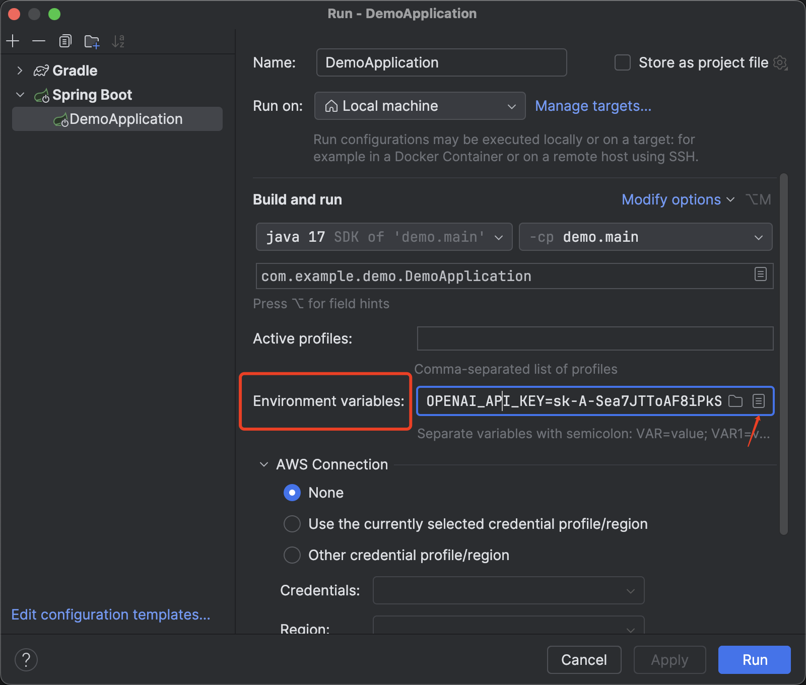
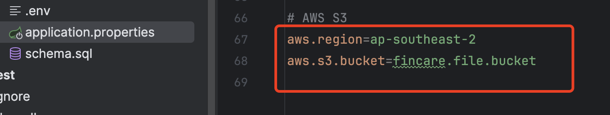
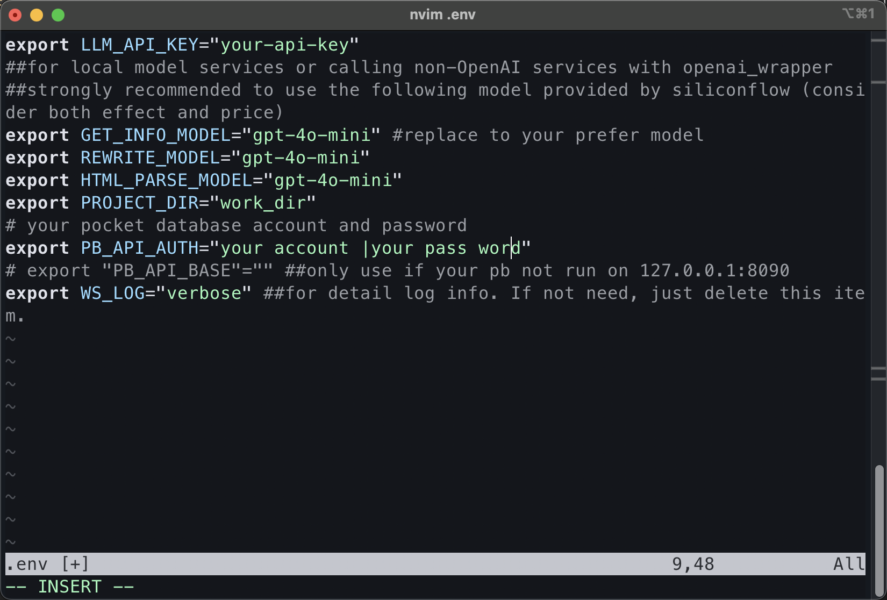
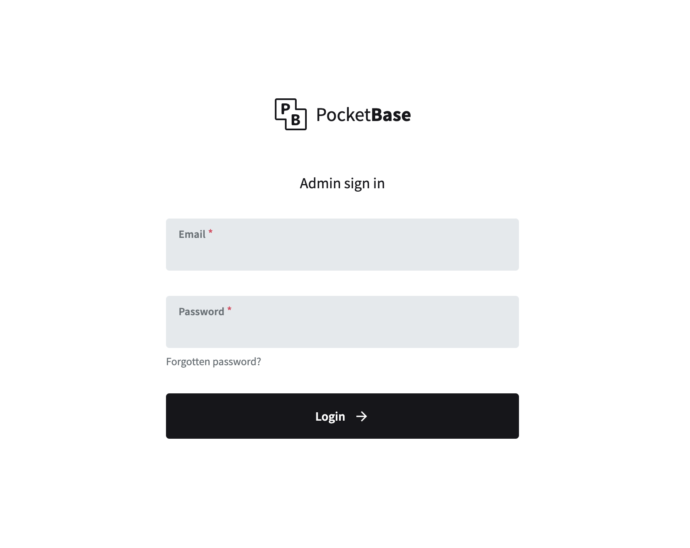

# Fin_care
Fin_care is a web application that allows users to manage their financial data and insights by multiple AI driven functionalities.
# Chinese Version
[README_zh.md](README_zh.md)

## Tech Stack

### Frontend


### Backend


### Message Queue


### Communication Protocol


### External API


### Database


## Architecture
RESTful API and event-driven architecture

## Features
### AI-driven functionalities
###  **Agents Cluster with Multi-Functionality**

A cluster of three multi-functional agents—**RecordRetriever**, **StockAnalyzer**, and **WeatherAnalyzer**—integrated with a chatbot, operates using a **three-level decision tree** for autonomous function selection based on user prompts. Here’s an overview of the decision-making flow:

- **Level 1: Agent Selection**  
  The chatbot initially selects the relevant agent based on the type of user query. Each agent (e.g., StockAnalyzer, RecordRetriever) is chosen according to its defined capabilities.

- **Level 2: Function Selection within Agent**  
  The chosen agent then identifies the specific function based on the user’s prompt. For example, if StockAnalyzer is activated, it will determine if the request is related to stock data, company details, or historical trends.

- **Level 3: Response Verification and Optimization**  
  The response generated by the agent is verified to ensure it aligns with the user’s query. If necessary, further optimizations are applied to refine the output.


### **Anti-scam Transaction Agent**

The **Anti-scam Transaction Agent** is a real-time monitoring tool designed to detect suspicious activities in uploaded transactions. It leverages **RabbitMQ** for message queuing, **WebSocket** for real-time alerts, and **Spring AI** for behavior analysis, providing efficient, real-time processing.

- **Implementation Logic**  
  This agent functions through an **event-driven** approach. When a client submits a transaction via a **POST request**, the system asynchronously sends the transaction data through **RabbitMQ** to the analysis agent. The agent reviews transaction history from the last 10 days as context, evaluating the current transaction using pre-configured behavioral models in **Spring AI**.

- **Suspicious Activity Detection**  
  If suspicious behavior is identified, the agent generates a **warning message** (prefixed with “WARNING”) and sends it instantly to the frontend via **WebSocket**. The frontend then decides how to manage these warnings, ensuring flexible handling.


### **Chatbot with RAG and Context Memory**

This **chatbot component** integrates **Spring AI** with the **Chroma Vector Database** to provide an advanced conversational experience, enhanced by **Retrieval-Augmented Generation (RAG)** and contextual memory.

- **File Vectorization and Storage**  
  Uploaded files are automatically vectorized and stored in the **vector database**, enabling efficient retrieval and knowledge augmentation during conversations.

- **RAG-Enhanced Responses**  
  When RAG is enabled in a client request, the chatbot utilizes the vectorized content to generate enriched, knowledge-based responses.

- **Context Memory Management**  
  The system employs **ChatMemory** and **MessageChatMemoryAdvisor** to maintain context, using unique **conversationIds** for each chat session. This ensures isolated context and chat memories for separate conversation threads.


### **Highly Customized Personal Finance Report**

This feature includes a standalone interface that retrieves up to the **20 most recent transactions** from the user’s database records. Through a **highly customized prompt manager**, these transactions are converted into a detailed prompt for the **LLM** (Large Language Model). The LLM then references stored documents in the **vector database** as context to generate a personalized, recent **financial status report** for the user.


### **AI-Driven Web Crawl**

This module allows users to **customize and retrieve specific web content** using the **Wiseflow Engine**. It provides full management, display, and synchronization of **investment themes** and **articles**.

- **Features**  
  Users can add, edit, or delete themes and articles. Each theme includes a **name** and **description**, while each article stores the **title**, **URL**, **summary**, and **content**. Data is fetched through a **database interface** and displayed at page initialization.

- **Soft Delete and Real-Time Sync**  
  Themes can be soft-deleted by marking their status as false, allowing for easy restoration. The module supports **real-time synchronization and search**, subscribing to data changes and automatically refreshing the page to display the latest themes and articles. Keyword filtering is also supported, enabling users to quickly find specific content.


### Other functionalities
1. Stock Price
- Real-time Stock Price driven by AlphaVantage API
2. Chat History
- Support user to view their chat history
3. File Persistence
- Support user to upload their financial data and files to the AWS S3

### Performance
- Use Redis to cache frequently accessed data
- Use async processing to improve performance

### Scalability
- Low coupling and high reusability code.

### Security
- Private files(e.g. bank statement) stored in AWS S3 are protected by ACL
- User authentication and authorization by using Spring Security 6(integrated with JWT)


### User Experience
- Responsive design by using Tailwind CSS
- event-driven architecture for smooth user experience by using WebSocket and RabbitMQ
- Intuitive UI/UX
- Google map API for location-based service
- Real-time Stock Price driven by AlphaVantage API

### Basic CRUD
- User management
- Transaction management
- File management
- Chat history management

### Future Work
- Implement a mobile application
- Implement a distributed storage system on TiDB
- Chatbot memory management

## Let's Get Started! (Currently support MacOS and linux)
### 1. Clone the repository
```bash
git clone https://github.com/CSUYSD/Anti-Scam-Financial-Management-Assistant.git
```

### 2. Install dependencies and start services
```bash
cd Anti-Scam-Financial-Management-Assistant/Backend
./setup.sh
cd ../Frontend
npm install
```

### 3. Configure environment variables
3.1 API keys
Put your api key in the following format in IDEA run configuration
OPENAI_API_KEY="your openai api key"
ALPHA_VANTAGE_API_KEY="your alpha vantage api key"


### 4. File Persistence(optional)
if you want enable AWS S3 for file persistence, follow these steps:
1. Configure your own aws credentials
2. create a bucket
3. replace the text in `Backend/src/main/resources/application.properties` with your own bucket name and region(see the following picture)


### 5. Ai web crawler(optional)


run the following command to clone the wiseflow repository
```bash
git clone https://github.com/TeamWiseFlow/wiseflow.git
cd wiseflow
cp .env.example .env
nvim .env
```
then you will see the following picture, replace the text with your own wise flow api key
notice: If you find your .env file has any variable that not present in the picture, delete it.

till this step, you don't have pocketbase db account yet, so you need to create one, run
```bash
docker compose up
```
notice: first time running the container will encounter an expected error, because you haven't created an admin account for the pb repository yet.
please keep the container running, open http://127.0.0.1:8090/_/ in your browser, and create an admin account according to the prompt(you must use email), then fill the admin email and password into the .env file, and restart the container.



### 6. Start the application
```bash
cd ../Backend
./start.sh
cd ../Frontend
npm start
```


